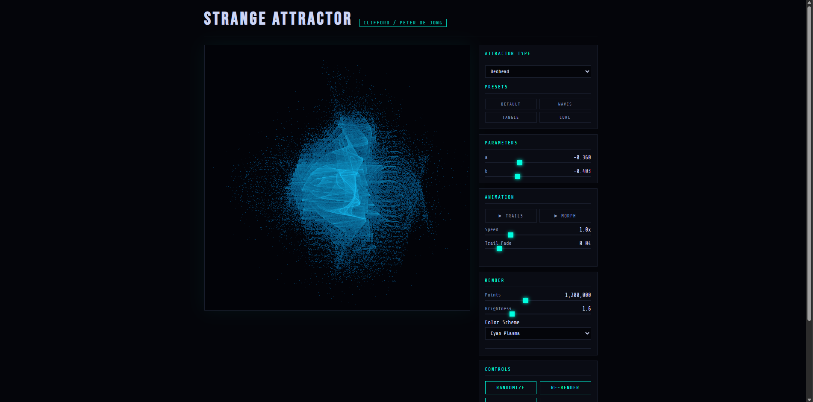

# Strange Attractor Visualizer

An interactive strange attractor visualizer built with vanilla HTML5 Canvas and JavaScript. Renders Clifford, Peter de Jong, and Bedhead attractors using log-density histogram rendering across up to 3 million points. Zero dependencies. Single file.



## ✨ Features

- **3 attractor types** — Clifford, Peter de Jong, Bedhead
- **Log-density rendering** — brighter where the attractor visits most, revealing hidden structure
- **2 animation modes:**
  - **Trails** — streams live particles with fade decay and cycling color
  - **Morph** — smoothly interpolates between random parameter sets in real-time
- **Full parameter control** — tweak a/b/c/d sliders and watch the shape respond
- **5 color schemes** — Cyan Plasma, Fire, Aurora, Bone, Neon Coral
- **Presets** — jump to known beautiful configurations per attractor type
- **Save PNG** — export any frame at full canvas resolution
- **Zero dependencies** — pure HTML, CSS, and JavaScript

## 🚀 Usage

No install, no build step. Just open the file:

```bash
# Clone the repo
git clone https://github.com/untruesudo/strange-attractor.git

# Open in browser
open strange-attractor/index.html
```

Or use it directly via GitHub Pages:
**[untruesudo.github.io/strange-attractor](https://untruesudo.github.io/strange-attractor)**

## 🎮 Controls

| Control | Description |
|---|---|
| Attractor Type | Switch between Clifford, Peter de Jong, Bedhead |
| a / b / c / d | Core equation parameters — small changes = big shape shifts |
| Presets | Jump to hand-picked beautiful configurations |
| ▶ Trails | Stream live particles with hue-cycling color |
| ▶ Morph | Auto-interpolate between random parameter sets |
| Speed | Animation playback speed |
| Trail Fade | How fast old particles ghost away |
| Points | Number of points for static render (up to 3M) |
| Brightness | Log-density gamma correction |
| Randomize | Jump to a random configuration |
| Save PNG | Export current canvas as a PNG |

## 🧮 How It Works

Strange attractors are defined by a pair of equations iterated millions of times:

```
x₊₁ = sin(a·y) + c·cos(a·x)
y₊₁ = sin(b·x) + d·cos(b·y)
```

A single point bounces through these equations, never repeating, never random — tracing out a fractal structure. The visualizer uses **log-density histogram rendering**: each pixel accumulates a count of how many times the trajectory passed through it, then maps that count to color via a logarithmic scale. Areas visited more often glow brighter.

## 📁 Structure

```
strange-attractor/
├── index.html      # Entire app — one self-contained file
├── README.md
├── LICENSE
├── preview.png     # Screenshot for README
└── .gitignore
```

## 📄 License

MIT — see [LICENSE](LICENSE)
